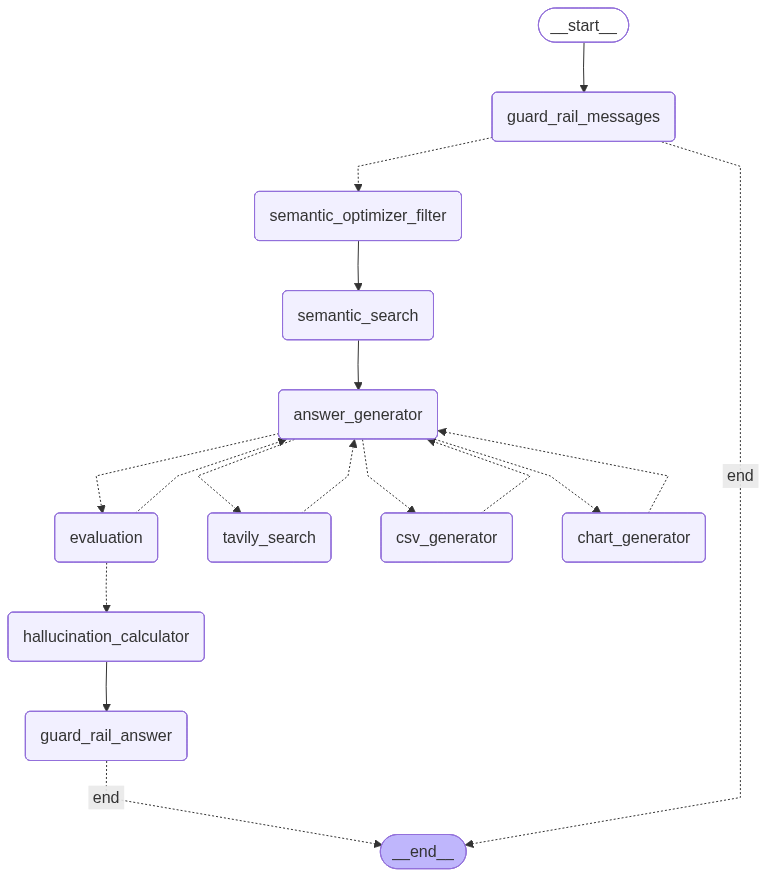

# RAG Chatbot MVP - LangGraph

<p align="center">
  
</p>

<p align="center">
  
  
</p>

## Overview

A RAG-powered chatbot built with **LangGraph** that answers questions about **Production and Planted Area of Crops by State (2017-2022)** from Malaysia's Department of Statistics (DOSM). The chatbot provides citation-backed responses and is equipped with two custom tools for data visualization and research.

## ⚡ Quick Quickstart (≤10 min)

Get up and running in under 10 minutes:
```bash
# 1. Clone the repository
git clone https://github.com/DigitalDungeon01
cd rag-chatbot-mvp

# 2. Install dependencies using uv
uv sync

# 3. Configure environment variables
# Copy the example environment file
cp .env.example .env  # On Unix/Linux/Mac
# OR
copy .env.example .env  # On Windows

# Edit .env with your API keys:
# - OpenAI API Key (GPT-4 Mini)
# - Tavily API Key: Get free API at https://app.tavily.com/home
# - Zilliz Milvus Cloud credentials (request access via GitHub issues if needed)


# 4. Run the chatbot
uv run agent/main.py

# 5. Open in browser
# Navigate to: http://127.0.0.1:7860
```

**Prerequisites:**
- Python 3.10+
- [uv](https://github.com/astral-sh/uv) package manager
- API keys for: OpenAI (GPT-4 Mini), Tavily Search, Zilliz Milvus Cloud

**Getting API Keys:**
- **Tavily Search API**: [Generate free API key here](https://app.tavily.com/home)
- **Zilliz Cloud Access**: Request access via GitHub issues if you need the vector store

**Note:** The vector database is already populated. For re-ingestion, see `notebooks/ingestor.ipynb`

**My setup:**
- Linux

## Tech Stack

### Core Framework
- **LangGraph**: Agentic workflow orchestration
- **LangChain**: LLM application framework

### AI Models
- **LLM**: GPT-4 Mini (OpenAI)
- **Embeddings**: all-MiniLM-L6-v2 (Sentence Transformer)

### Infrastructure
- **Vector Database**: Zilliz Milvus Cloud
- **Package Manager**: uv
- **Web Search**: Tavily Search API
- **Chart Generation**: QuickChart.io

### MCP Tools
- **FastMCP**: Custom MCP server framework
- **Remote MCP**: Tavily integration

### Dependencies
See `requirements.txt` for complete list of Python packages.

## Features

### General Features
- **LangGraph Framework**: Agentic workflow orchestration with state management and decision-making capabilities
- **RAG Pipeline**: 
  - Manual ETL process for text processing, chunking, and embedding generation
  - Vector embeddings stored in Zilliz Milvus Cloud
  - Semantic search for intelligent document retrieval directly from cloud
- **Data Ingestion**: Jupyter notebook (.ipynb) workflow for data preprocessing and vector upload
- **Online Search Integration**: Tavily search API for supplementing answers with real-time web information
- **Citation-Backed Responses**: All answers include source references from retrieved documents

### MCP Tools
- **Chart Generator**: Custom MCP tool for creating data visualizations from query results
- **CSV File Generator**: Custom MCP tool for exporting filtered data and analysis results

## Dataset
- **Name**: Crop Area and Production by State
- **Description**: Production and planted area of crops by state (2017-2022), categorized by crop type
- **Source**: [Department of Statistics Malaysia (DOSM)](https://open.dosm.gov.my/)
- **Full Details**: See [data_card.md](./database/data-collection/data_card.md)

## Installation

This project uses [uv](https://github.com/astral-sh/uv) for fast Python package management.

1. Install dependencies:
```bash
uv sync
```

2. Configure environment variables:
```bash
cp .env.example .env  # Unix/Linux/Mac
# OR
copy .env.example .env  # Windows
```
Edit `.env` file with your API keys (see `.env.example` for required variables)

## Usage

### Running the Chatbot

To start the chatbot system:
```bash
uv run agent/main.py
```
The application will be available at:
```
Running on local URL: http://127.0.0.1:7860
```

Access the chatbot interface by opening the URL in your web browser.

## RAG Design

### Data Ingestion & Processing
The ETL pipeline is implemented in Jupyter notebook for data preprocessing and vectorization.

**Process:**
1. Data extraction from DOSM dataset
2. Text processing and cleaning
3. Document chunking
4. Embedding generation
5. Upload to vector database

**Reference:** See `notebooks/ingestor.ipynb` for implementation details

### Chunking Strategy
- **Chunk Size**: 200 tokens
- **Overlap**: 50 tokens
- **Method**: Recursive character splitting for maintaining context coherence

### Embedding Model
- **Model**: all-MiniLM-L6-v2 (Sentence Transformer)
- **Purpose**: Convert text chunks into dense vector representations for semantic search
- **Dimensions**: 384-dimensional embeddings

### Vector Store
- **Database**: Zilliz Milvus Cloud
- **Type**: Cloud-hosted vector database
- **Features**: Scalable semantic search and similarity matching

### Retrieval Configuration
- **Top-k**: 13 (configurable)
- **Location**: `agent/nodes.py` → `semantic_search()` function
- **Adjustable**: Modify `k` parameter in the function:
```python
async def semantic_search(state: State) -> dict:
    k = 13  # Adjustable retrieval count
    # ... retrieval logic
```

**Note:** The `k` value determines the number of most relevant document chunks retrieved for each query.

## Project Flow

<p align="center">
  
</p>

### Generate Flow Diagram

To regenerate the flow diagram:
```bash
uv run agent/flow_image_gen.py
```

## MCP Tools Documentation

This project implements three MCP (Model Context Protocol) tools to extend the chatbot's capabilities: two custom-built tools and one remote integration.

### Architecture

**Client Configuration:** `agent/mcp_tools/mcp_client.py`

All MCP tools are configured to communicate via stdio transport, enabling seamless integration with the LangGraph agent.

### 1. Tavily Search (Remote MCP Server)

**Purpose:** Real-time web search for supplementing answers with current information

**Configuration:**
```python
"tavily-remote-mcp": {
    "command": "npx",
    "args": ["-y", "mcp-remote", f"https://mcp.tavily.com/mcp/?tavilyApiKey={Settings.TAVILY_API_KEY}"],
    "env": {},
    "transport": "stdio"
}
```

**Type:** Remote MCP server (provided by Tavily)

**Documentation:** [Tavily MCP Official Docs](https://docs.tavily.com/documentation/mcp)

### 2. CSV Generator (Custom Local Server)

**Purpose:** Export filtered data and query results to CSV format

**Server:** `agent/mcp_tools/csv_gen_server.py`

**Configuration:**
```python
"csv-gen": {
    "command": "uv",
    "args": ["run", f"{csv_server_path}"],
    "env": {},
    "transport": "stdio"
}
```

**Output Location:** `database/user-database/`

**Framework:** Built with [FastMCP](https://docs.langchain.com/oss/python/langchain/mcp)

**Features:**
- Generates CSV files from query results
- Saves files locally for user download
- Supports data filtering and aggregation

### 3. Chart Generator (Custom Local Server)

**Purpose:** Create visual data representations from query results

**Server:** `agent/mcp_tools/chart_server.py`

**Configuration:**
```python
"chart-generator": {
    "command": "uv",
    "args": ["run", "agent/mcp_tools/chart_server.py"],
    "env": {},
    "transport": "stdio"
}
```

**Service:** [QuickChart.io](https://quickchart.io) API for chart rendering

**Output:** Returns a URL link to the generated chart image

**Framework:** Built with [FastMCP](https://docs.langchain.com/oss/python/langchain/mcp)

**Features:**
- Multiple chart types (bar, line, pie, etc.)
- Dynamic chart generation based on data
- Accessible via shareable links

### Custom MCP Server Implementation

Both custom tools (CSV Generator and Chart Generator) are built using the **FastMCP** framework:

**Reference Documentation:** [LangChain FastMCP Guide](https://docs.langchain.com/oss/python/langchain/mcp)

**Key Features:**
- Stdio transport for local execution
- Managed by `uv run` for dependency isolation
- Event-driven architecture for async operations

## Data & Evaluation

### Dataset Files
- **Raw Data:** `database/data-collection/crops_state(1).csv`
- **Data Card:** `database/data-collection/data_card.md`

### Evaluation Methodology

The system uses LLM-based evaluation to assess response quality:

**Retrieval Hit Rate:** Measures the effectiveness of semantic search in retrieving relevant documents from the vector database

**Hallucination Rate:** An LLM evaluator analyzes:
- Retrieved documents from vector database
- Online search results (if used)
- Generated answer

The evaluator determines if the answer is grounded in the provided sources or contains hallucinated information.

**Evaluation Process:**
- Runs automatically during chatbot operation
- Generates evaluation metrics per query
- Outputs results with confidence scores

### Evaluation Files

**Auto-Generated (Overwritten on each run):**
- `eval/query_answer_result.jsonl` - Latest evaluation results (not saved permanently)

**Saved Evaluation Example:**
- `eval/queries_with_results.jsonl` - 15 test queries with results including:
  - Query text
  - Answer with citation sources
  - Confidence score
  - Chart links (clickable URLs for generated visualizations)

**Note:** To preserve evaluation results, rename the auto-generated file after system shutdown before the next run.

**Viewing Charts:** Click on the chart URLs in the answer field to view generated visualizations.

### Evaluation Scores

Refer to `eval/queries_with_results.jsonl` for detailed evaluation metrics from the latest test run.

## Confidence Scoring Fallback Routing

The system assigns confidence scores (0.0-1.0) based on response quality and relevance:

- **0.8-1.0 (High)**: 
  - Accurate, clear, agriculture-related, and data-backed answers
  - Clarification questions that help understand user needs
- **0.4-0.7 (Medium)**: 
  - Partial answers that need more information
- **0.2 (Low)**: 
  - "I don't have enough information" responses
- **0.0-0.3 (Very Low)**: 
  - Off-topic, vague, or incorrect answers

## Responsible AI

The system implements several safeguards to ensure responsible AI behavior:

### Guard Rails

**Input Filtering:** The system detects and blocks queries containing:
- Harmful or offensive language
- Personal identifying information (PII)
- Attempts to jailbreak or bypass system constraints
- Inappropriate or malicious content

**Response Validation:** All generated responses are validated to ensure:
- Answers are grounded in retrieved sources
- No generation of harmful or misleading content
- Adherence to agricultural data scope
- Appropriate tone and professionalism

### Handling Outdated Data
- System acknowledges data limitations (dataset coverage: 2017-2022)
- Provides disclaimers when data may be outdated
- Suggests verifying current information through online search

### User Disclaimers
- Clear communication about data sources and coverage periods
- Citation requirements for all factual claims
- Confidence scores to indicate answer reliability

### Refusal Cases
The system handles inappropriate queries by:
- Detecting off-topic or out-of-scope questions
- Providing polite refusals with explanations
- Suggesting alternative queries within scope

**Examples available in:** `eval/queries_with_results.jsonl`

## Project Structure
```
rag-chatbot-mvp/
├── agent/                          # Main agent implementation
│   ├── config.py                   # Configuration settings
│   ├── flow_image_gen.py          # Flow diagram generator
│   ├── graph.py                    # LangGraph workflow definition
│   ├── llm.py                      # LLM integration
│   ├── main.py                     # Entry point
│   ├── nodes.py                    # Graph node implementations
│   ├── prompts.py                  # Prompt templates
│   ├── retriever.py                # Vector retrieval logic
│   ├── schema.py                   # Data schemas
│   ├── state.py                    # State management
│   ├── img/                        # Images and diagrams
│   ├── mcp_tools/                  # MCP tool implementations
│   │   ├── chart_server.py        # Chart generation server
│   │   ├── csv_gen_server.py      # CSV export server
│   │   └── mcp_client.py          # MCP client configuration
│   └── utils/                      # Utility modules
│       └── logger.py               # Logging utilities
│
├── database/
│   ├── data-collection/           # Source data
│   │   ├── crops_state(1).csv    # Raw dataset
│   │   └── data_card.md          # Dataset metadata
│   └── user-database/             # Generated CSV exports
│
├── eval/
│   ├── queries_with_results.jsonl  # Saved evaluation history (15 Q&A)
│   └── query_answer_result.jsonl  # Auto-generated (overwritten)
│
├── notebooks/
│   └── ingestor.ipynb             # ETL pipeline for data ingestion
│
├── .env.example                    # Environment variables template
├── readme.md                       # This file
└── requirements.txt                # Python dependencies
```

## Limitations & Future Work

### Current Limitations
- Dataset limited to 2017-2022 (requires manual updates)
- Static chunking strategy (fixed size and overlap)
- Manual ETL process for data ingestion

### Future Improvements
- **Automated ETL Pipeline**: Streamline data ingestion with scheduled updates (feasible but requires additional development time)
- **Dynamic Chunking**: Implement context-aware chunking based on document structure and content type
- **Mistral Pixtral Multimodal RAG**: Support for multiple document types including charts, PDFs, analytical visualizations, Excel files, and other structured data formats
- **Docling Integration**: Enhanced document processing capabilities for images and diverse document formats with improved text extraction
